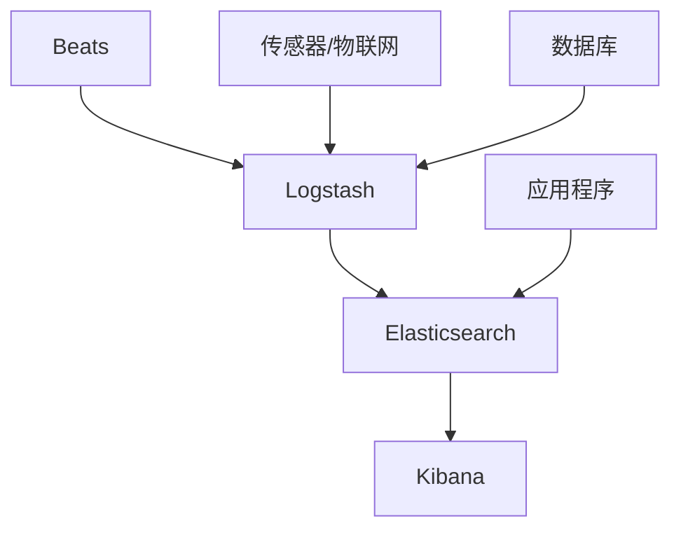
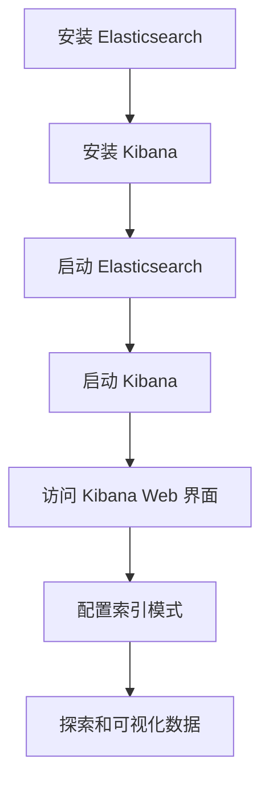

# Kibana 介绍

可视化、分析和探索您的 Elasticsearch 数据

<div class="pt-12">
  <span @click="$slidev.nav.next" class="px-2 py-1 rounded cursor-pointer" hover="bg-white bg-opacity-10">
    按空格键进入下一页 <carbon:arrow-right class="inline"/>
  </span>
</div>

<div class="abs-br m-6 flex gap-2">
  <a href="https://www.elastic.co/kibana/" target="_blank" alt="Kibana 网站"
    class="text-xl icon-btn opacity-50 !border-none !hover:text-white">
    <carbon-logo-github />
  </a>
</div>

---

# 什么是 Kibana？

Kibana 是一个免费开源的用户界面，让您可以可视化 Elasticsearch 数据并浏览 Elastic Stack

- 📊 **数据可视化** - 创建和共享动态仪表板
- 🔍 **搜索和分析** - 强大的跨数据搜索能力
- 🚀 **实时分析** - 实时监控您的数据
- 🛠 **管理和监控** - 管理和监控 Elastic Stack
- 🧑‍💻 **开发者工具** - 内置的 Elasticsearch 开发工具

<br>

Kibana 与 Elasticsearch 无缝协作，让您能够实时探索、可视化和分析数据。

<style>
h1 {
  background-color: #2B90B6;
  background-image: linear-gradient(45deg, #4EC5D4 10%, #146b8c 20%);
  background-size: 100%;
  -webkit-background-clip: text;
  -moz-background-clip: text;
  -webkit-text-fill-color: transparent;
  -moz-text-fill-color: transparent;
}
</style>

---
layout: two-cols
---

# Kibana 在 Elastic Stack 中的角色

了解 Kibana 在 Elastic 生态系统中的作用

::right::



- **Beats**：轻量级数据采集器
- **Logstash**：数据处理管道
- **Elasticsearch**：分布式搜索和分析引擎
- **Kibana**：可视化和管理用户界面

---
layout: image-right
image: https://source.unsplash.com/collection/94734566/1920x1080
---

# Kibana 的主要功能

探索 Kibana 的强大功能

- **Lens**：拖放界面，轻松创建可视化
- **仪表板**：组合可视化，提供全面视图
- **Discover**：使用强大的搜索功能探索数据
- **Canvas**：创建具有动态元素的信息图表风格显示
- **地图**：地理空间分析和可视化
- **机器学习**：异常检测和预测
- **警报和操作**：根据数据设置通知
- **APM**：分布式系统的应用性能监控

---
layout: two-cols
---
# Kibana 入门

使用 Kibana 的基本步骤：


::right::

1. 安装 Elasticsearch 和 Kibana（可以通过 Docker、包管理器或手动安装）
2. 启动两个服务（确保在启动 Kibana 之前 Elasticsearch 已运行）
3. 通过网络浏览器访问 Kibana（默认：http://localhost:5601）
4. 配置索引模式，将 Kibana 与您的 Elasticsearch 数据连接
5. 使用 Kibana 直观的界面开始探索和可视化您的数据

---

# Kibana 的 Discover 页面

Discover 页面是您数据探索的起点

<div grid="~ cols-2 gap-4">
<div>

主要功能：
- 交互式过滤
- 全文搜索
- 字段选择
- 时间范围选择
- 保存和共享搜索
- 查看文档数据

</div>
<div>

```javascript
// Kibana 查询语言 (KQL) 查询示例
response:200 and agent.keyword:"Mozilla"
  and not (url.keyword:"/admin" or method:"POST")
```

Discover 页面允许您：
1. 搜索您的数据
2. 过滤结果
3. 检查字段统计信息
4. 查看原始文档

</div>
</div>

---

# Kibana 可视化概述

Kibana 提供多种可视化类型，以有效表示您的数据

<div grid="~ cols-2 gap-4">
<div>

常用可视化类型：
- 折线图、面积图和柱状图
- 饼图和环形图
- 数据表格和指标可视化
- 标签云和热力图
- 坐标地图和区域地图
- TSVB（时间序列可视化构建器）
- Vega 和 Vega-Lite 可视化

</div>
<div>

Kibana 可视化的主要优势：
- 交互式和动态
- 实时数据更新
- 可自定义外观
- 可共享和嵌入
- 支持大型数据集
- 与 Elasticsearch 查询集成

</div>
</div>

---

# 在 Kibana 中创建可视化

创建可视化的步骤指南

1. 导航到 Kibana 中的 Visualize 页面
2. 点击"创建可视化"或"+"按钮
3. 选择可视化类型
4. 选择数据源（索引模式或已保存的搜索）
5. 配置可视化：
   - 选择指标（如计数、总和、平均值）
   - 设置数据聚合的桶
   - 调整坐标轴、标签和颜色
6. 使用高级选项进行微调
7. 保存并添加到仪表板

提示：使用 Lens 获得更直观的拖放体验

---

# Kibana Lens：简化的可视化

Lens 是 Kibana 的拖放界面，用于创建可视化

<div grid="~ cols-2 gap-4">
<div>

主要特点：
- 直观的拖放界面
- 自动图表建议
- 快速字段统计
- 轻松调整坐标轴和指标
- 支持多种图表类型
- 与仪表板无缝集成

</div>
<div>
<SlidevVideo v-click autoplay controls>
  <!-- Anything that can go in an HTML video element. -->
  <source src="https://assets.contentstack.io/v3/assets/bltefdd0b53724fa2ce/blt034e1f94972746c4/5fa31f08bfc5dd7188659497/video-kibana-lens-bar-tree-710.mp4" type="video/mp4" />
  <p>
    你的浏览器不支持播放该视频，请点击
    <a href="https://assets.contentstack.io/v3/assets/bltefdd0b53724fa2ce/blt034e1f94972746c4/5fa31f08bfc5dd7188659497/video-kibana-lens-bar-tree-710.mp4">此处</a>
    下载。
  </p>
</SlidevVideo>

<a href="https://www.elastic.co/cn/kibana/kibana-lens" target="_blank">Lens</a> 简化了创建可视化的过程，使各种技能水平的用户都能轻松使用。

</div>
</div>

---

# 高级可视化技术

将您的 Kibana 可视化提升到更高水平

<div grid="~ cols-2 gap-4">
<div>

1. **TSVB（时间序列可视化构建器）**
   - 创建复杂的时间序列可视化
   - 组合多个数据源和计算

2. **Vega 和 Vega-Lite**
   - 使用声明性语言创建自定义可视化
   - 创建高度自定义和交互式图表

3. **Timelion**
   - 时间序列数据可视化
   - 组合来自多个源的数据

</div>
<div>

4. **Elastic Maps**
   - 可视化地理空间数据
   - 与其他 Kibana 可视化结合

5. **Canvas**
   - 创建信息图表风格的演示
   - 结合静态和动态元素

6. **仪表板下钻**
   - 创建交互式、链接的可视化
   - 使用户能够深入探索数据

</div>
</div>

---
layout: image-right
image: https://www.elastic.co/guide/en/kibana/master/images/dashboard-overview.png
backgroundSize: contain
---
# Kibana 仪表板：概述

将可视化组合成强大的交互式仪表板

功能：
- 组合相关可视化
- 自定义布局和大小
- 添加过滤器和时间范围
- 使用下钻进行详细分析
- 与他人共享仪表板
- 导出为 PDF 或 PNG
- 设置自动刷新间隔

仪表板允许您创建数据的全面视图，将多个可视化和搜索组合到一个交互式面板中。

---

# 创建和自定义仪表板

构建有效仪表板的步骤指南

<div grid="~ cols-2 gap-4">
   <div>

      1. 导航到 Kibana 中的 Dashboard 页面

      2. 点击"创建仪表板"或"+"按钮

      3. 添加可视化：
         - 点击"添加"并选择已保存的可视化
         - 或直接从仪表板创建新的可视化

      4. 排列和调整面板大小：
         - 拖放重新定位
         - 使用角落手柄调整大小
   </div>
   <div>

      5. 设置仪表板属性：
         - 时间范围
         - 过滤器
         - 刷新间隔

      6. 自定义面板选项：
         - 编辑可视化设置
         - 设置面板标题

      7. 保存并共享仪表板
   </div>
</div>

---

# 仪表板交互性和过滤器

通过交互元素增强用户体验

<div grid="~ cols-2 gap-4">
   <div>

   1. **全局过滤器**
      - 在所有可视化中应用过滤器
      - 使用 KQL（Kibana 查询语言）进行复杂过滤

   2. **时间范围选择器**
      - 为基于时间的数据设置全局时间范围
      - 使用相对或绝对时间范围

   3. **面板过滤器**
      - 对特定可视化应用过滤器
      - 用于比较数据子集

   </div>
   <div>

   4. **下钻**
      - 在仪表板或可视化之间创建链接
      - 使用户能够更详细地探索数据

   5. **已保存的搜索**
      - 在仪表板中包含 Discover 页面搜索
      - 将原始数据与可视化结合

   6. **动态控件**
      - 添加输入控件以进行用户驱动的过滤
      - 创建下拉菜单、滑块或文本输入

   </div>
</div>

---

# Kibana 仪表板最佳实践

创建有效和用户友好仪表板的技巧

1. **从明确的目标开始**：定义仪表板的目的和受众
2. **保持简单**：避免用太多可视化使界面混乱
3. **使用适当的可视化**：选择最能代表您数据的图表类型
4. **逻辑组织**：将相关的可视化组合在一起
5. **一致的样式**：使用统一的配色方案和格式
6. **优化性能**：注意查询效率和数据量
7. **提供上下文**：添加文本面板来解释仪表板元素
8. **使用有意义的标题**：为面板和仪表板使用清晰、描述性的标题
9. **启用交互性**：利用过滤器、下钻和时间范围选择器
10. **定期更新**：保持仪表板的时效性和相关性

---

# 共享和嵌入 Kibana 可视化

使您的见解对他人可访问

<div grid="~ cols-2 gap-4">
<div>

**共享选项：**
1. 直接链接
   - 共享仪表板或可视化的 URL
2. 保存的对象
   - 导出和导入仪表板配置
3. PNG/PDF 导出
   - 生成静态图像或文档
4. 报告
   - 安排和自动化报告生成

</div>
<div>

**嵌入：**
1. iframe 嵌入
   - 将 Kibana 可视化集成到网页中
2. 仅 Kibana 仪表板
   - 嵌入仪表板的简化视图
3. Canvas
   - 创建适合演示的可视化
4. Kibana API
   - 以编程方式访问和嵌入内容

</div>
</div>

在共享 Kibana 内容时，请记住考虑安全性和访问控制！

---

# Kibana 使用案例

Kibana 用途广泛，可用于各种场景：

<div grid="~ cols-2 gap-4">
<div>

- 📊 **商业智能和数据分析**
  - 可视化销售趋势和客户行为
  - 创建执行仪表板

- 🔒 **安全信息和事件管理（SIEM）**
  - 监控网络流量并检测异常
  - 调查安全事件

- 📱 **应用性能监控（APM）**
  - 跟踪应用响应时间
  - 识别分布式系统中的瓶颈

</div>
<div>

- 🌐 **日志分析和 IT 运营**
  - 集中来自多个源的日志
  - 排查基础设施问题

- 🚀 **DevOps 监控和故障排除**
  - 监控 CI/CD 管道
  - 跟踪部署成功率

- 💼 **电子商务和用户行为分析**
  - 分析用户旅程和转化漏斗
  - 优化产品推荐

</div>
</div>

---

# 高级功能

Kibana 为高级用户提供高级功能：

<div grid="~ cols-2 gap-4">
   <div>

   - **机器学习**
      - 时间序列数据中的异常检测
      - 预测未来趋势
      - 离群值检测和分类

   - **图形探索**
      - 分析数据中的关系
      - 发现模式和连接

   - **Elastic Maps**
      - 地理空间分析和可视化
      - 支持多个地图图层
   </div>
   <div>

   - **警报**
        - 根据您的数据设置警报
        - 与各种通知渠道集成

   - **报告**
      - 生成和共享 PDF 报告
      - 安排自动报告生成

   - **空间**
      - 组织仪表板和可视化
      - 实现多租户设置

   这些功能可以实现更深入的洞察和更复杂的数据分析。
   </div>
</div>


---

# Kibana 安全功能

确保您的数据和仪表板受到保护

<div grid="~ cols-2 gap-4">
<div>

主要安全功能：
- 基于角色的访问控制
- SSL/TLS 加密
- 认证提供者（LDAP、Active Directory 等）
- 审计日志
- IP 过滤
- 用于安全集成的 API 密钥

</div>
<div>

```yaml
# Kibana 安全配置示例
xpack.security.enabled: true
xpack.security.authc:
  providers:
    basic.basic1:
      order: 0
    ldap.ldap1:
      order: 1
      url: "ldaps://ldap.example.com:636"
      bindDN: "cn=kibana,ou=users,dc=example,dc=com"
      bindPassword: "${LDAP_PASSWORD}"
      userSearchBase: "ou=users,dc=example,dc=com"
      userSearchFilter: "(cn={0})"
      groupSearchBase: "ou=groups,dc=example,dc=com"
      groupSearchFilter: "(member={0})"
```

</div>
</div>

---

# Kibana 开发和定制

扩展 Kibana 的功能以满足您的特定需求

<div grid="~ cols-2 gap-4">
<div>

定制 Kibana 的方法：
- 开发自定义插件
- 创建自定义可视化
- 在您的应用程序中嵌入 Kibana 仪表板
- 使用 Kibana 的 RESTful API
- 为开源项目做贡献

</div>
<div>

```typescript
// 简单的 Kibana 插件示例
import { PluginInitializerContext } from '../../../src/core/server';
import { MyPlugin } from './plugin';

export function plugin(initializerContext: PluginInitializerContext) {
  return new MyPlugin(initializerContext);
}

export { MyPlugin as Plugin };
```

Kibana 的插件架构允许广泛的定制和与其他系统的集成。

</div>
</div>

---
layout: center
class: text-center
---

# 了解更多关于 Kibana 的信息

[官方文档](https://www.elastic.co/guide/en/kibana/current/index.html) · [Kibana GitHub](https://github.com/elastic/kibana) · [Elastic 社区](https://www.elastic.co/community/)

今天就开始用 Kibana 探索您的数据吧！

---
layout: center
class: text-center
---

# 谢谢！

有任何问题吗？